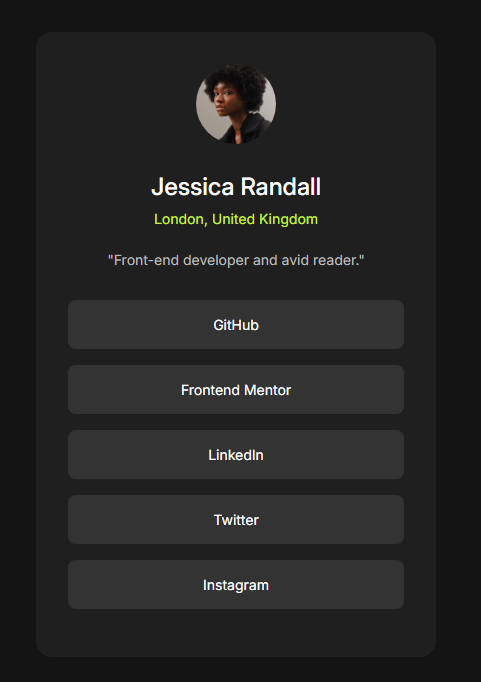

# Social Links Profile - Challenge

## Descrição

Este projeto é uma implementação de um perfil de links sociais, inspirado em um desafio do Frontend Mentor. Ele apresenta um design responsivo e moderno para exibir informações de perfil e links para várias plataformas de mídia social.

## Características

- Layout responsivo que se adapta a diferentes tamanhos de tela
- Perfil com foto, nome, localização e breve descrição
- Links para várias plataformas sociais (GitHub, Frontend Mentor, LinkedIn, Twitter, Instagram)
- Efeitos de hover nos links
- Esquema de cores escuro para melhor contraste e aparência moderna

## Tecnologias Utilizadas

- HTML5
- CSS3
- Fontes do Google (Inter)

## Estrutura do Projeto

- `index.html`: Estrutura principal da página
- `css/style.css`: Estilos CSS para o layout e design
- `assets/images/`: Diretório contendo imagens utilizadas no projeto

## Responsividade

O design é totalmente responsivo, com ajustes específicos para:

- Telas até 450px de largura
- Telas até 380px de largura

## Como Usar

1. Clone este repositório
2. Abra o arquivo `index.html` em seu navegador

## Créditos

Design inspirado por um desafio do [Frontend Mentor](https://www.frontendmentor.io).

## Autor

Carlos Daniel

## Licença

[Tipo de Licença, se aplicável]
